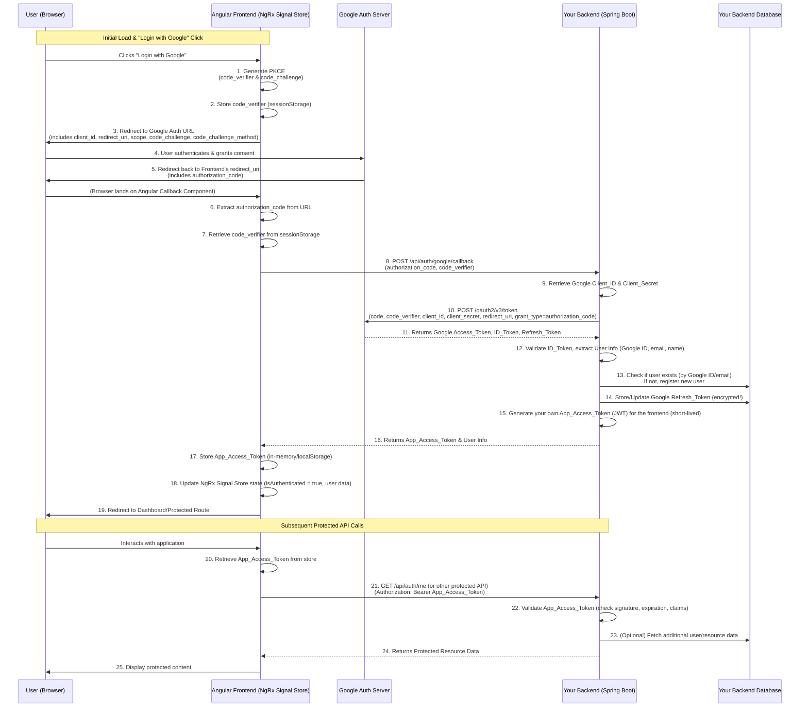

# OAuth2 with Spring Boot and Angular & NGRX

Implementing Google authorization for a production web application using best practices involves several crucial steps, especially when integrating with an Angular NgRx Signal Store. The key is to prioritize security, user experience, and maintainability.

This guide will focus on the **Authorization Code Flow with PKCE (Proof Key for Code Exchange)**, which is the recommended flow for Single Page Applications (SPAs) like Angular apps. It prevents authorization code interception attacks and is highly secure.

### Best Practices for Production

1.  **Backend for Token Exchange:**
    * **NEVER exchange the authorization code for access/refresh tokens directly from your Angular frontend.** This requires your `client_secret`, which must be kept confidential and never exposed in client-side code.
    * Instead, your Angular app will redirect the user to Google for authorization. Google then redirects back to your Angular app with an authorization `code`.
    * Your Angular app sends this `code` to **your own backend server**, which then exchanges the `code` for `access_token` and `refresh_token` with Google's authorization server.
    * Your backend then securely stores the `refresh_token` (e.g., in an encrypted database) and sends the `access_token` (and optionally a short-lived, custom session token) back to your Angular app.

2.  **PKCE (Proof Key for Code Exchange):**
    * PKCE adds an extra layer of security, especially for public clients (like SPAs) that cannot securely store a `client_secret`.
    * Your frontend generates a `code_verifier` (a cryptographically random string) and a `code_challenge` (a hashed version of the `code_verifier`).
    * The `code_challenge` is sent in the initial authorization request to Google.
    * When your backend exchanges the authorization `code` for tokens, it also sends the original `code_verifier`. Google verifies that the `code_verifier` matches the `code_challenge` received earlier. This ensures that only the legitimate client that initiated the request can complete the token exchange.

3.  **Secure Token Storage:**
    * **Access Token:** Store the Google `access_token` (or a custom short-lived session token from your backend) **in memory** (e.g., in your NgRx Signal Store). It should be cleared on page refresh or tab close.
    * **Refresh Token:** Store Google `refresh_token`s **only on your backend server, in an encrypted database.** Never send the Google `refresh_token` to the client. Your backend will use the `refresh_token` to obtain new `access_token`s from Google when the existing one expires.
    * **HttpOnly Cookies for Session:** If your backend issues its own session token to the client, store it in a `HttpOnly` and `Secure` cookie. This protects against XSS attacks.

4.  **HTTPS Everywhere:** All communication (frontend to backend, backend to Google) must use HTTPS.

5.  **Limited Scopes:** Request only the minimum necessary permissions (scopes) from the user. For basic login, `openid`, `email`, and `profile` are usually sufficient.

6.  **Error Handling and User Feedback:** Provide clear error messages to the user if authentication fails.

7.  **OAuth Consent Screen:** Configure your Google OAuth consent screen in Google Cloud Console. This includes setting up your application name, logo, privacy policy, and terms of service. Your domain must be verified.

8.  **Token Revocation:** Implement a way for users to revoke access to your application through their Google Account settings, and for your application to revoke tokens if necessary (e.g., on logout).

---

### Sequence Diagram

Here's a sequence diagram illustrating the Google Authorization Code Flow with PKCE using your Angular NgRx Signal Store frontend and Spring Boot backend.



**Explanation of the Flow:**

1.  **Initiation (1-3):** The user starts the process from your Angular app. The frontend generates a unique `code_verifier` and its `code_challenge` (PKCE). The `code_verifier` is stored locally (e.g., in `sessionStorage`) for later use. The browser is then redirected to Google's authorization endpoint with the `code_challenge` and other OAuth parameters.
2.  **User Authorization (4-5):** Google authenticates the user (if not already logged in) and presents the consent screen. Upon user approval, Google redirects the browser back to your Angular app's `redirect_uri`, including an `authorization_code`.
3.  **Code Transfer to Backend (6-8):** Your Angular `AuthCallbackComponent` captures the `authorization_code` from the URL. It retrieves the stored `code_verifier` and sends both to your Spring Boot backend's dedicated callback endpoint (`/api/auth/google/callback`).
4.  **Backend Token Exchange (9-11):** Your Spring Boot backend, acting as a confidential client, takes the `authorization_code` and `code_verifier` and sends them *along with its confidential `client_secret`* to Google's token endpoint. Google validates these credentials (including the PKCE `code_challenge` against the `code_verifier`) and, if valid, issues a Google `access_token`, `id_token`, and importantly, a Google `refresh_token`.
5.  **Backend User Management & Custom Token Issuance (12-15):** Your Spring Boot backend processes the Google tokens. It extracts user information from the `id_token`. It then performs its own internal user management (e.g., checking if the user exists in your database or creating a new entry). Crucially, it stores the **Google `refresh_token` securely in its database (encrypted)**. Finally, it generates **its own short-lived `App_Access_Token` (a JWT)** for your frontend.
6.  **Frontend Receives & Stores Custom Token (16-19):** Your Spring Boot backend sends this `App_Access_Token` (and user info) back to the Angular frontend. The Angular app stores this token (preferably in-memory for security, or `localStorage` as a fallback for persistence across browser sessions, acknowledging the XSS risk). The NgRx Signal Store is updated, and the user is redirected to a protected part of your application.
7.  **Protected API Calls (20-25):** For any subsequent requests to your Spring Boot backend's protected API endpoints, your Angular frontend retrieves the `App_Access_Token` from its store and includes it in the `Authorization: Bearer` header. Your Spring Boot backend validates this `App_Access_Token` locally (by verifying its signature and expiration) and responds with the requested data.

This diagram clearly shows the separation of concerns and the secure handling of sensitive credentials on the backend.

---

### Implementation Steps (High-Level)

Given the complexity, we'll outline the architecture and key code snippets.

**A. Google Cloud Console Setup**

1.  **Create a Project:** Go to Google Cloud Console, create a new project.
2.  **Enable APIs:** Enable the Google People API (if you need user profile info beyond basic OpenID Connect claims) or other Google APIs your app will use.
3.  **OAuth Consent Screen:**
    * Configure the "OAuth consent screen." Set user type to "External" for production apps.
    * Add your application name, user support email, developer contact information.
    * **Add your authorized domains (your website's domain).**
    * Define the scopes your application will request (e.g., `email`, `profile`, `openid`).
4.  **Credentials:**
    * Create "OAuth client ID." Select "Web application."
    * **Authorized JavaScript origins:** Add your frontend URL (e.g., `https://your-app.com`, `http://localhost:4200` for development).
    * **Authorized redirect URIs:** Add the URI where Google will redirect after authorization (e.g., `https://your-app.com/auth/callback`, `http://localhost:4200/auth/callback`). **This must be a path that your Angular app can handle.**
    * Note your `client_id` (public) and `client_secret` (confidential, for your backend).

**B. Backend (Spring Boot)**

Okay, let's implement the Google authorization flow with a Spring Boot backend, following best practices for production-ready applications.

This setup will utilize:
* **Authorization Code Flow with PKCE**: The most secure and recommended OAuth 2.0 flow for Single Page Applications (SPAs).
* **Spring Boot Backend**: Acts as your secure server-side component, handling the sensitive token exchange with Google and issuing its own custom JWTs to the frontend.
* **NgRx Signal Store Frontend**: Initiates the Google OAuth flow and then interacts with your Spring Boot backend.
* **Secure Token Handling**: Google's refresh tokens are stored securely on your backend, while your backend-issued JWTs (access tokens) are sent to the frontend for in-memory storage.

---

### **Part 1: Spring Boot Backend**

#### **1. Project Setup (`pom.xml`)**

Create a new Spring Boot project (or add these dependencies to an existing one).

```xml
<?xml version="1.0" encoding="UTF-8"?>
<project xmlns="http://maven.apache.org/POM/4.0.0" xmlns:xsi="http://www.w3.org/2001/XMLSchema-instance"
         xsi:schemaLocation="http://maven.apache.org/POM/4.0.0 https://maven.apache.org/xsd/maven-4.0.0.xsd">
    <modelVersion>4.0.0</modelVersion>
    <parent>
        <groupId>org.springframework.boot</groupId>
        <artifactId>spring-boot-starter-parent</artifactId>
        <version>3.2.5</version> <!-- Use a recent stable version -->
        <relativePath/> <!-- lookup parent from repository -->
    </parent>
    <groupId>com.example</groupId>
    <artifactId>auth-backend</artifactId>
    <version>0.0.1-SNAPSHOT</version>
    <name>auth-backend</name>
    <description>Demo project for Spring Boot Google Auth</description>

    <properties>
        <java.version>17</java.version>
    </properties>

    <dependencies>
        <!-- Spring Boot Web Starter for building RESTful APIs -->
        <dependency>
            <groupId>org.springframework.boot</groupId>
            <artifactId>spring-boot-starter-web</artifactId>
        </dependency>
        <!-- Spring Boot Security Starter for authentication and authorization -->
        <dependency>
            <groupId>org.springframework.boot</groupId>
            <artifactId>spring-boot-starter-security</artifactId>
        </dependency>
        <!-- Spring Boot OAuth2 Client for Google integration -->
        <dependency>
            <groupId>org.springframework.boot</groupId>
            <artifactId>spring-boot-starter-oauth2-client</artifactId>
        </dependency>
        <!-- JWT dependencies for creating and validating tokens -->
        <dependency>
            <groupId>io.jsonwebtoken</groupId>
            <artifactId>jjwt-api</artifactId>
            <version>0.12.5</version>
        </dependency>
        <dependency>
            <groupId>io.jsonwebtoken</groupId>
            <artifactId>jjwt-impl</artifactId>
            <version>0.12.5</version>
            <scope>runtime</scope>
        </dependency>
        <dependency>
            <groupId>io.jsonwebtoken</groupId>
            <artifactId>jjwt-jackson</artifactId>
            <version>0.12.5</version>
            <scope>runtime</scope>
        </dependency>

        <!-- Spring Boot Test Starter -->
        <dependency>
            <groupId>org.springframework.boot</groupId>
            <artifactId>spring-boot-starter-test</artifactId>
            <scope>test</scope>
        </dependency>
        <!-- Spring Security Test for testing secure endpoints -->
        <dependency>
            <groupId>org.springframework.security</groupId>
            <artifactId>spring-security-test</artifactId>
            <scope>test</scope>
        </dependency>
    </dependencies>

    <build>
        <plugins>
            <plugin>
                <groupId>org.springframework.boot</groupId>
                <artifactId>spring-boot-maven-plugin</artifactId>
            </plugin>
        </plugins>
    </build>

</project>
```

#### **2. Configuration (`src/main/resources/application.yml`)**

You'll need your Google Client ID and Secret obtained from the Google Cloud Console.

```yaml
# src/main/resources/application.yml
spring:
  security:
    oauth2:
      client:
        registration:
          google:
            client-id: ${GOOGLE_CLIENT_ID} # Set this in environment variables or application.properties
            client-secret: ${GOOGLE_CLIENT_SECRET} # Set this in environment variables or application.properties
            redirect-uri: ${FRONTEND_URL}/auth/callback # IMPORTANT: This should be your Angular frontend's callback URL
            scope: openid,email,profile
            authorization-grant-type: authorization_code
        provider:
          google:
            authorization-uri: https://accounts.google.com/o/oauth2/v2/auth
            token-uri: https://oauth2.googleapis.com/token
            user-info-uri: https://www.googleapis.com/oauth2/v3/userinfo
            jwk-set-uri: https://www.googleapis.com/oauth2/v3/certs
            user-name-attribute: sub

app:
  jwtSecret: aSuperSecretKeyForYourJWTsThatShouldBeAtLeast256BitsLongAndStoredSecurely # Change this for production!
  jwtExpirationMs: 3600000 # 1 hour in milliseconds (short-lived access token)

server:
  port: 8080 # Backend port
```

**Important Notes on `application.yml`:**
* **`GOOGLE_CLIENT_ID` and `GOOGLE_CLIENT_SECRET`**: **DO NOT hardcode these in production.** Use environment variables (e.g., `export GOOGLE_CLIENT_ID=...`) or a secrets management service.
* **`redirect-uri`**: This *must* match the "Authorized redirect URIs" configured in your Google Cloud Console for your web application OAuth 2.0 Client ID. It points to your **frontend** callback.
* **`app.jwtSecret`**: Generate a strong, random secret key (e.g., using a tool like `openssl rand -base64 32`) and store it securely.

#### **3. DTOs and Models**

```java
// src/main/java/com/example/authbackend/dto/AuthRequest.java
package com.example.authbackend.dto;

public class AuthRequest {
    private String code;
    private String codeVerifier;

    // Getters and Setters
    public String getCode() {
        return code;
    }

    public void setCode(String code) {
        this.code = code;
    }

    public String getCodeVerifier() {
        return codeVerifier;
    }

    public void setCodeVerifier(String codeVerifier) {
        this.codeVerifier = codeVerifier;
    }
}
```
```java
// src/main/java/com/example/authbackend/dto/LoginResponse.java
package com.example.authbackend.dto;

import com.example.authbackend.model.User;

public class LoginResponse {
    private User user;
    private String accessToken;

    public LoginResponse(User user, String accessToken) {
        this.user = user;
        this.accessToken = accessToken;
    }

    // Getters and Setters
    public User getUser() {
        return user;
    }

    public void setUser(User user) {
        this.user = user;
    }

    public String getAccessToken() {
        return accessToken;
    }

    public void setAccessToken(String accessToken) {
        this.accessToken = accessToken;
    }
}
```
```java
// src/main/java/com/example/authbackend/model/User.java
package com.example.authbackend.model;

// This is a simplified User model. In a real app, you'd have
// fields for roles, last login, etc., and persist it to a database.
public class User {
    private String id; // Google 'sub'
    private String email;
    private String firstName;
    private String lastName;
    // ... any other relevant user data

    public User(String id, String email, String firstName, String lastName) {
        this.id = id;
        this.email = email;
        this.firstName = firstName;
        this.lastName = lastName;
    }

    // Getters and Setters
    public String getId() {
        return id;
    }

    public void setId(String id) {
        this.id = id;
    }

    public String getEmail() {
        return email;
    }

    public void setEmail(String email) {
        this.email = email;
    }

    public String getFirstName() {
        return firstName;
    }

    public void setFirstName(String firstName) {
        this.firstName = firstName;
    }

    public String getLastName() {
        return lastName;
    }

    public void setLastName(String lastName) {
        this.lastName = lastName;
    }
}
```

#### **4. JWT Service (`JwtService.java`)**

This service handles the creation and validation of your custom JWTs for the frontend.

```java
// src/main/java/com/example/authbackend/security/JwtService.java
package com.example.authbackend.security;

import io.jsonwebtoken.*;
import io.jsonwebtoken.io.Decoders;
import io.jsonwebtoken.security.Keys;
import org.slf4j.Logger;
import org.slf4j.LoggerFactory;
import org.springframework.beans.factory.annotation.Value;
import org.springframework.stereotype.Service;

import javax.crypto.SecretKey;
import java.util.Date;
import java.util.HashMap;
import java.util.Map;
import java.util.function.Function;

@Service
public class JwtService {

    private static final Logger logger = LoggerFactory.getLogger(JwtService.class);

    @Value("${app.jwtSecret}")
    private String jwtSecret;

    @Value("${app.jwtExpirationMs}")
    private int jwtExpirationMs;

    private SecretKey getSigningKey() {
        byte[] keyBytes = Decoders.BASE64.decode(jwtSecret);
        return Keys.hmacShaKeyFor(keyBytes);
    }

    public String generateToken(String userId, String email, String firstName, String lastName) {
        Map<String, Object> claims = new HashMap<>();
        claims.put("email", email);
        claims.put("firstName", firstName);
        claims.put("lastName", lastName);

        return Jwts.builder()
                .claims(claims)
                .subject(userId)
                .issuedAt(new Date(System.currentTimeMillis()))
                .expiration(new Date(System.currentTimeMillis() + jwtExpirationMs))
                .signWith(getSigningKey(), Jwts.SIG.HS256)
                .compact();
    }

    public boolean validateToken(String token) {
        try {
            Jwts.parser()
                    .verifyWith(getSigningKey())
                    .build()
                    .parseSignedClaims(token);
            return true;
        } catch (MalformedJwtException e) {
            logger.error("Invalid JWT token: {}", e.getMessage());
        } catch (ExpiredJwtException e) {
            logger.error("JWT token is expired: {}", e.getMessage());
        } catch (UnsupportedJwtException e) {
            logger.error("JWT token is unsupported: {}", e.getMessage());
        } catch (IllegalArgumentException e) {
            logger.error("JWT claims string is empty: {}", e.getMessage());
        }
        return false;
    }

    public String extractUserId(String token) {
        return extractClaim(token, Claims::getSubject);
    }

    public String extractUserEmail(String token) {
        return extractClaim(token, claims -> claims.get("email", String.class));
    }

    public String extractUserFirstName(String token) {
        return extractClaim(token, claims -> claims.get("firstName", String.class));
    }

    public String extractUserLastName(String token) {
        return extractClaim(token, claims -> claims.get("lastName", String.class));
    }

    private <T> T extractClaim(String token, Function<Claims, T> claimsResolver) {
        final Claims claims = extractAllClaims(token);
        return claimsResolver.apply(claims);
    }

    private Claims extractAllClaims(String token) {
        return Jwts.parser()
                .verifyWith(getSigningKey())
                .build()
                .parseSignedClaims(token)
                .getPayload();
    }
}
```

#### **5. Custom User Details and Authentication (`CustomUserDetailsService.java`, `JwtAuthFilter.java`)**

These are standard Spring Security components.

```java
// src/main/java/com/example/authbackend/security/CustomUserDetailsService.java
package com.example.authbackend.security;

import org.springframework.security.core.userdetails.User;
import org.springframework.security.core.userdetails.UserDetails;
import org.springframework.security.core.userdetails.UserDetailsService;
import org.springframework.security.core.userdetails.UsernameNotFoundException;
import org.springframework.stereotype.Service;

import java.util.ArrayList;
import java.util.Collections;
import java.util.HashMap;
import java.util.Map;

// This service is simplified. In a real application, you would load user details
// from your database based on the authenticated user ID from the JWT.
@Service
public class CustomUserDetailsService implements UserDetailsService {

    // Simulating a user store. In production, this would be a database.
    private final Map<String, UserDetails> users = new HashMap<>();

    public CustomUserDetailsService() {
        // Initialize with a dummy user for JWT validation example
        // The actual user details will come from Google OAuth after successful login
        users.put("testuser@example.com",
                new User("testuser@example.com", "{noop}password", Collections.emptyList()));
    }

    @Override
    public UserDetails loadUserByUsername(String email) throws UsernameNotFoundException {
        // For JWT-based authentication, we primarily rely on the JWT for user details
        // This method might be called by Spring Security's DaoAuthenticationProvider if you were using
        // traditional username/password. For our Google OAuth flow, the JWT's subject (user ID)
        // and claims will be directly used to build an Authentication object in JwtAuthFilter.
        // This implementation is minimal because the user details come from Google, not a password store.
        return new org.springframework.security.core.userdetails.User(
                email, "", new ArrayList<>() // Empty password, no roles for simplicity
        );
    }
}
```
```java
// src/main/java/com/example/authbackend/security/JwtAuthFilter.java
package com.example.authbackend.security;

import jakarta.servlet.FilterChain;
import jakarta.servlet.ServletException;
import jakarta.servlet.http.HttpServletRequest;
import jakarta.servlet.http.HttpServletResponse;
import org.springframework.security.authentication.UsernamePasswordAuthenticationToken;
import org.springframework.security.core.context.SecurityContextHolder;
import org.springframework.security.web.authentication.WebAuthenticationDetailsSource;
import org.springframework.stereotype.Component;
import org.springframework.web.filter.OncePerRequestFilter;

import java.io.IOException;

@Component
public class JwtAuthFilter extends OncePerRequestFilter {

    private final JwtService jwtService;

    public JwtAuthFilter(JwtService jwtService) {
        this.jwtService = jwtService;
    }

    @Override
    protected void doFilterInternal(HttpServletRequest request,
                                    HttpServletResponse response,
                                    FilterChain filterChain) throws ServletException, IOException {
        final String authHeader = request.getHeader("Authorization");
        final String jwt;
        final String userId; // Or email, depending on what you use as subject

        if (authHeader == null || !authHeader.startsWith("Bearer ")) {
            filterChain.doFilter(request, response);
            return;
        }

        jwt = authHeader.substring(7);
        userId = jwtService.extractUserId(jwt);

        if (userId != null && SecurityContextHolder.getContext().getAuthentication() == null) {
            // Validate the token. We don't load UserDetails here as the JWT already contains claims.
            if (jwtService.validateToken(jwt)) {
                // Construct Authentication object directly from JWT claims
                String email = jwtService.extractUserEmail(jwt);
                String firstName = jwtService.extractUserFirstName(jwt);
                String lastName = jwtService.extractUserLastName(jwt);

                // Create a User object based on JWT claims (simplified)
                org.springframework.security.core.userdetails.User principal = new org.springframework.security.core.userdetails.User(
                    email, // Username (email in this case)
                    "", // Password (not relevant for JWT authentication)
                    java.util.Collections.emptyList() // Authorities/Roles (add if you have roles in JWT)
                );

                UsernamePasswordAuthenticationToken authToken = new UsernamePasswordAuthenticationToken(
                        principal, null, principal.getAuthorities()
                );
                authToken.setDetails(
                        new WebAuthenticationDetailsSource().buildDetails(request)
                );
                SecurityContextHolder.getContext().setAuthentication(authToken);
            }
        }
        filterChain.doFilter(request, response);
    }
}
```

#### **6. Security Configuration (`SecurityConfig.java`)**

This configures Spring Security to use your JWT filter and allows CORS.

```java
// src/main/java/com/example/authbackend/security/SecurityConfig.java
package com.example.authbackend.security;

import org.springframework.context.annotation.Bean;
import org.springframework.context.annotation.Configuration;
import org.springframework.security.authentication.AuthenticationProvider;
import org.springframework.security.authentication.dao.DaoAuthenticationProvider;
import org.springframework.security.config.annotation.web.builders.HttpSecurity;
import org.springframework.security.config.annotation.web.configuration.EnableWebSecurity;
import org.springframework.security.config.http.SessionCreationPolicy;
import org.springframework.security.core.userdetails.UserDetailsService;
import org.springframework.security.crypto.password.NoOpPasswordEncoder; // For simplicity, use BCryptPasswordEncoder in production
import org.springframework.security.crypto.password.PasswordEncoder;
import org.springframework.security.web.SecurityFilterChain;
import org.springframework.security.web.authentication.UsernamePasswordAuthenticationFilter;
import org.springframework.web.cors.CorsConfiguration;
import org.springframework.web.cors.CorsConfigurationSource;
import org.springframework.web.cors.UrlBasedCorsConfigurationSource;

import java.util.Arrays;
import java.util.Collections;

@Configuration
@EnableWebSecurity
public class SecurityConfig {

    private final JwtAuthFilter jwtAuthFilter;
    private final CustomUserDetailsService userDetailsService;

    public SecurityConfig(JwtAuthFilter jwtAuthFilter, CustomUserDetailsService userDetailsService) {
        this.jwtAuthFilter = jwtAuthFilter;
        this.userDetailsService = userDetailsService;
    }

    @Bean
    public SecurityFilterChain securityFilterChain(HttpSecurity http) throws Exception {
        http
            .csrf(csrf -> csrf.disable()) // Disable CSRF for stateless JWTs
            .cors(cors -> cors.configurationSource(corsConfigurationSource())) // Enable CORS
            .authorizeHttpRequests(authorize -> authorize
                .requestMatchers("/api/auth/**").permitAll() // Allow unauthenticated access to auth endpoints
                .anyRequest().authenticated() // All other requests require authentication
            )
            .sessionManagement(session -> session.sessionCreationPolicy(SessionCreationPolicy.STATELESS)) // Use stateless sessions for JWT
            .authenticationProvider(authenticationProvider())
            .addFilterBefore(jwtAuthFilter, UsernamePasswordAuthenticationFilter.class); // Add JWT filter

        return http.build();
    }

    @Bean
    public AuthenticationProvider authenticationProvider() {
        DaoAuthenticationProvider authProvider = new DaoAuthenticationProvider();
        authProvider.setUserDetailsService(userDetailsService);
        authProvider.setPasswordEncoder(passwordEncoder()); // Use NoOpPasswordEncoder for simplicity, change for production
        return authProvider;
    }

    @Bean
    public PasswordEncoder passwordEncoder() {
        // Use BCryptPasswordEncoder in production:
        // return new BCryptPasswordEncoder();
        return NoOpPasswordEncoder.getInstance(); // For demonstration purposes only
    }

    @Bean
    public CorsConfigurationSource corsConfigurationSource() {
        CorsConfiguration configuration = new CorsConfiguration();
        configuration.setAllowedOrigins(Arrays.asList("http://localhost:4200")); // Your Angular app's URL
        configuration.setAllowedMethods(Arrays.asList("GET", "POST", "PUT", "DELETE", "OPTIONS"));
        configuration.setAllowedHeaders(Arrays.asList("Authorization", "Content-Type"));
        configuration.setAllowCredentials(true); // Allow sending cookies/auth headers
        UrlBasedCorsConfigurationSource source = new UrlBasedCorsConfigurationSource();
        source.registerCorsConfiguration("/**", configuration); // Apply to all paths
        return source;
    }
}
```

#### **7. Auth Controller (`AuthController.java`)**

This is the main entry point for your Angular application to interact with Google OAuth.

```java
// src/main/java/com/example/authbackend/controller/AuthController.java
package com.example.authbackend.controller;

import com.example.authbackend.dto.AuthRequest;
import com.example.authbackend.dto.LoginResponse;
import com.example.authbackend.model.User;
import com.example.authbackend.security.JwtService;
import org.springframework.beans.factory.annotation.Value;
import org.springframework.http.ResponseEntity;
import org.springframework.security.oauth2.client.registration.ClientRegistration;
import org.springframework.security.oauth2.client.registration.ClientRegistrationRepository;
import org.springframework.security.oauth2.core.AuthorizationGrantType;
import org.springframework.stereotype.Service;
import org.springframework.web.bind.annotation.*;
import org.springframework.web.client.RestTemplate;
import org.springframework.http.HttpHeaders;
import org.springframework.http.MediaType;
import org.springframework.http.HttpEntity;
import org.springframework.util.LinkedMultiValueMap;
import org.springframework.util.MultiValueMap;

import java.net.URI;
import java.util.HashMap;
import java.util.Map;
import java.util.UUID; // For simulating refresh token storage

@RestController
@RequestMapping("/api/auth")
public class AuthController {

    private final ClientRegistrationRepository clientRegistrationRepository;
    private final JwtService jwtService;
    private final RestTemplate restTemplate;

    // Simulate refresh token storage (in production, use an encrypted database)
    private final Map<String, String> refreshTokens = new HashMap<>(); // userId -> refreshToken

    public AuthController(ClientRegistrationRepository clientRegistrationRepository, JwtService jwtService) {
        this.clientRegistrationRepository = clientRegistrationRepository;
        this.jwtService = jwtService;
        this.restTemplate = new RestTemplate(); // For making HTTP calls to Google's token endpoint
    }

    @Value("${FRONTEND_URL}")
    private String frontendUrl; // Injected from application.yml or environment

    // This endpoint is not directly used by the frontend in PKCE flow for web apps.
    // Frontend initiates Google login by redirecting directly to Google's auth URL.
    // It's shown for completeness if backend-initiated flow was desired (e.g., for server-side redirects).
    @GetMapping("/google/login")
    public ResponseEntity<?> redirectToGoogleLogin() {
        ClientRegistration googleClientRegistration = clientRegistrationRepository.findByRegistrationId("google");
        String authorizationUri = googleClientRegistration.getProviderDetails().getAuthorizationUri() +
                "?response_type=code" +
                "&client_id=" + googleClientRegistration.getClientId() +
                "&scope=" + String.join(" ", googleClientRegistration.getScopes()) +
                "&redirect_uri=" + googleClientRegistration.getRedirectUri() +
                "&access_type=offline" + // Request a refresh token
                "&prompt=consent select_account"; // Force consent screen
        return ResponseEntity.status(302).location(URI.create(authorizationUri)).build();
    }

    @PostMapping("/google/callback")
    public ResponseEntity<LoginResponse> handleGoogleCallback(@RequestBody AuthRequest authRequest) {
        try {
            ClientRegistration googleClientRegistration = clientRegistrationRepository.findByRegistrationId("google");

            // Build request to Google's token endpoint
            HttpHeaders headers = new HttpHeaders();
            headers.setContentType(MediaType.APPLICATION_FORM_URLENCODED);

            MultiValueMap<String, String> body = new LinkedMultiValueMap<>();
            body.add("client_id", googleClientRegistration.getClientId());
            body.add("client_secret", googleClientRegistration.getClientSecret());
            body.add("code", authRequest.getCode());
            body.add("redirect_uri", frontendUrl + "/auth/callback"); // Must match the one sent in initial auth request
            body.add("grant_type", AuthorizationGrantType.AUTHORIZATION_CODE.getValue());
            body.add("code_verifier", authRequest.getCodeVerifier()); // PKCE

            HttpEntity<MultiValueMap<String, String>> requestEntity = new HttpEntity<>(body, headers);

            // Exchange authorization code for tokens
            ResponseEntity<Map> tokenResponse = restTemplate.postForEntity(
                    googleClientRegistration.getProviderDetails().getTokenUri(),
                    requestEntity,
                    Map.class
            );

            String googleAccessToken = (String) tokenResponse.getBody().get("access_token");
            String googleRefreshToken = (String) tokenResponse.getBody().get("refresh_token"); // Will be null if access_type=offline not used, or first time login

            // Get user info from Google
            HttpHeaders userInfoHeaders = new HttpHeaders();
            userInfoHeaders.setBearerAuth(googleAccessToken);
            ResponseEntity<Map> userInfoResponse = restTemplate.postForEntity(
                    googleClientRegistration.getProviderDetails().getUserInfoUri(),
                    new HttpEntity<>(userInfoHeaders),
                    Map.class
            );

            Map<String, Object> googleUserInfo = userInfoResponse.getBody();
            String googleId = (String) googleUserInfo.get("sub");
            String email = (String) googleUserInfo.get("email");
            String firstName = (String) googleUserInfo.get("given_name");
            String lastName = (String) googleUserInfo.get("family_name");

            // --- Your application's user management logic ---
            // 1. Check if user exists in your database based on googleId or email.
            // 2. If not, create a new user account.
            // 3. Store Google's refresh_token securely in your database, linked to your user.
            //    It MUST be encrypted at rest.
            if (googleRefreshToken != null) {
                // In production: Encrypt and store in database
                refreshTokens.put(googleId, googleRefreshToken); // Simplified: In-memory map
            }

            // Create your internal user model
            User user = new User(googleId, email, firstName, lastName);

            // Generate your own JWT for the frontend
            String appAccessToken = jwtService.generateToken(user.getId(), user.getEmail(), user.getFirstName(), user.getLastName());

            return ResponseEntity.ok(new LoginResponse(user, appAccessToken));

        } catch (Exception e) {
            e.printStackTrace();
            return ResponseEntity.status(500).body(null);
        }
    }

    // Example of a protected endpoint
    @GetMapping("/me")
    public ResponseEntity<User> getUserInfo(@RequestHeader("Authorization") String token) {
        String jwt = token.substring(7); // Remove "Bearer " prefix
        String userId = jwtService.extractUserId(jwt);
        String email = jwtService.extractUserEmail(jwt);
        String firstName = jwtService.extractUserFirstName(jwt);
        String lastName = jwtService.extractUserLastName(jwt);

        User currentUser = new User(userId, email, firstName, lastName);
        return ResponseEntity.ok(currentUser);
    }
}
```

#### **8. Main Application Class (`AuthBackendApplication.java`)**

```java
// src/main/java/com/example/authbackend/AuthBackendApplication.java
package com.example.authbackend;

import org.springframework.boot.SpringApplication;
import org.springframework.boot.autoconfigure.SpringBootApplication;

@SpringBootApplication
public class AuthBackendApplication {

    public static void main(String[] args) {
        SpringApplication.run(AuthBackendApplication.class, args);
    }

}
```

#### **To Run the Spring Boot Backend:**

1.  **Obtain Google Credentials**: Go to Google Cloud Console > APIs & Services > Credentials. Create an "OAuth 2.0 Client ID" of type "Web application".
    * Set "Authorized JavaScript origins" to `http://localhost:4200` (your Angular app).
    * Set "Authorized redirect URIs" to `http://localhost:4200/auth/callback`.
    * Note down your Client ID and Client Secret.
2.  **Set Environment Variables**: Before running, set these environment variables (or directly in `application.yml` for testing, but NOT production):
    ```bash
    export GOOGLE_CLIENT_ID="YOUR_GOOGLE_CLIENT_ID_FROM_CONSOLE"
    export GOOGLE_CLIENT_SECRET="YOUR_GOOGLE_CLIENT_SECRET_FROM_CONSOLE"
    export FRONTEND_URL="http://localhost:4200" # Your Angular app's URL
    export app_jwtSecret="A_VERY_LONG_RANDOM_SECRET_KEY" # e.g., openssl rand -base64 32
    ```
3.  **Run**: Navigate to your project root in the terminal and run:
    ```bash
    ./mvnw spring-boot:run
    ```
    The backend should start on `http://localhost:8080`.

---

### **Part 2: Angular NgRx Signal Store Frontend**

#### **1. `auth.model.ts` (No change from previous response)**

```typescript
// src/app/auth/auth.model.ts
export interface User {
  id: string;
  email: string;
  firstName: string;
  lastName: string;
  // Add other user properties as needed
}

export interface AuthState {
  user: User | null;
  accessToken: string | null; // This is now YOUR internal JWT issued by Spring Boot
  isAuthenticated: boolean;
  isLoading: boolean;
  error: string | null;
}

export const initialAuthState: AuthState = {
  user: null,
  accessToken: null,
  isAuthenticated: false,
  isLoading: false,
  error: null,
};
```

#### **2. `auth.store.ts` (Minor Adjustment for PKCE generation)**

The `AuthStore` is largely the same, but `initiateGoogleLogin` will now handle PKCE logic directly and `loginSuccess` will store the backend's JWT.

```typescript
// src/app/auth/auth.store.ts
import { signalStore, withComputed, withHooks, withMethods, withState, patchState } from '@ngrx/signals'
import { AuthState, initialAuthState, User } from './auth.model';
import { inject, PLATFORM_ID } from '@angular/core';
import { isPlatformBrowser } from '@angular/common';
import { environment } from '../environment';
// IMPORTANT: For production, use a more robust PKCE library or Web Cryptography API
// This is a simplified PKCE implementation for demonstration.
// For example, see: [https://github.com/auth0/auth0-spa-js/blob/master/src/utils.ts](https://github.com/auth0/auth0-spa-js/blob/master/src/utils.ts)
// Or use 'pkce-challenge' npm package for Node.js if generating on backend.
// For browser, use window.crypto.subtle
import * as sha256 from 'js-sha256'; // npm install js-sha256

const AUTH_KEY = "auth";
const ACCESS_TOKEN_KEY = 'accessToken';
const TOKEN_EXIPIRY_KEY = "expiresIn";

const GOOGLE_CLIENT_ID = environment.GOOGLE_CLIENT_ID;

export const AuthStore = signalStore(
    { providedIn: 'root' },
    withState<AuthState>(initialAuthState),
    withComputed((store) => ({})),
    withMethods((store) => {

        const platformId = inject(PLATFORM_ID);
        const isBrowser = isPlatformBrowser(platformId);

        // PKCE Helper (simplified for demonstration)
        async function generatePkcePair(): Promise<{ verifier: string; challenge: string }> {
            const generateRandomString = (length: number) => {
                let text = '';
                const possible = 'ABCDEFGHIJKLMNOPQRSTUVWXYZabcdefghijklmnopqrstuvwxyz0123456789-._~';
                for (let i = 0; i < length; i++) {
                    text += possible.charAt(Math.floor(Math.random() * possible.length));
                }
                return text;
            };

            const verifier = generateRandomString(128); // Length between 43-128
            const encoder = new TextEncoder();
            const data = encoder.encode(verifier);
            const hashBuffer = await window.crypto.subtle.digest('SHA-256', data);
            const hashArray = Array.from(new Uint8Array(hashBuffer));
            const challenge = btoa(String.fromCharCode(...hashArray)) // Base64 encode
                .replace(/\+/g, '-') // Convert '+' to '-'
                .replace(/\//g, '_') // Convert '/' to '_'
                .replace(/=+$/, ''); // Remove trailing '='

            return { verifier, challenge };
        }

        return {
            //Public methods
            async initiateGoogleLogin() {
                if (!isBrowser) return;

                patchState(store, () => {
                    return { isLoading: true, error: null }
                });

                try {
                    const { verifier, challenge } = await generatePkcePair();

                    // Store verifier in sessionStorage to persist across redirect
                    sessionStorage.setItem('pkce_code_verifier', verifier);

                    // Build Google OAuth URL
                    const googleAuthUrl = new URL('https://accounts.google.com/o/oauth2/v2/auth');
                    googleAuthUrl.searchParams.set('client_id', GOOGLE_CLIENT_ID); // From Google Cloud Console
                    googleAuthUrl.searchParams.set('redirect_uri', 'http://localhost:4200/auth/callback'); // Must match console & Spring Boot config
                    googleAuthUrl.searchParams.set('response_type', 'code');
                    googleAuthUrl.searchParams.set('scope', 'openid email profile'); // Request minimal scopes
                    googleAuthUrl.searchParams.set('access_type', 'offline'); // To get a refresh token (handled by backend)
                    googleAuthUrl.searchParams.set('prompt', 'consent select_account'); // Force consent screen

                    // PKCE parameters
                    googleAuthUrl.searchParams.set('code_challenge', challenge);
                    googleAuthUrl.searchParams.set('code_challenge_method', 'S256');

                    window.location.href = googleAuthUrl.toString();
                } catch (error) {
                    console.error('Error generating PKCE or initiating login:', error);
                    patchState(store, () => {
                        return { isLoading: false, error: 'Error generating PKCE or initiating login' }
                    });
                }
            },

            loginSuccess(user: User, accessToken: string, expiresIn: number) {
                patchState(store, () => {
                    return {
                        user,
                        accessToken,
                        expiresIn,
                        isAuthenticated: true,
                        isLoading: false,
                        error: null,
                    }
                });

                if (isBrowser) {
                    localStorage.setItem(AUTH_KEY, JSON.stringify({
                       ACCESS_TOKEN_KEY: accessToken,
                       TOKEN_EXIPIRY_KEY: expiresIn,
                    })); // Storing YOUR internal token
                    sessionStorage.removeItem('pkce_code_verifier'); // Clean up PKCE verifier
                }
            },

            loginFailure(error: string) {
                patchState(store, () => {
                    return {
                        isLoading: false,
                        error,
                        isAuthenticated: false,
                    }
                });
                if (isBrowser) {
                    sessionStorage.removeItem('pkce_code_verifier'); // Clean up PKCE verifier on failure
                }
            },

            logout() {
                patchState(store, () => {
                    return {
                        user: null,
                        accessToken: null,
                        expiresIn: 0,
                        isAuthenticated: false,
                        isLoading: false,
                        error: null,
                    }
                });

                if (isBrowser) {
                    localStorage.removeItem(ACCESS_TOKEN_KEY);
                }
            },

            startLoading() {
                patchState(store, () => {
                    return { isLoading: true, error: null }
                });
            },

            // --- Private/Internal Methods ---
            _loadTokensFromStorage() {
                if (isBrowser) {
                    const auth = localStorage.getItem(AUTH_KEY);
                    if (auth) {
                        const { accessToken, expiresIn } = JSON.parse(auth);

                        // In a real app, you might decode the JWT locally to get user info
                        // and check expiration. Or make an API call to your backend /me endpoint.
                        patchState(store, () => {
                            return { accessToken, expiresIn, isAuthenticated: true }
                        });
                        // Optionally, if user is not fully populated, fetch from backend:
                        // inject(AuthService).fetchCurrentUser().subscribe();
                    }
                }
            },

            setUser(user: User) {
                patchState(store, () => {
                    return { user }
                });
            }
        }
    }),
    withHooks((store) => ({
        onInit() {
            store._loadTokensFromStorage();
          },
    }))
);
```

#### **3. `auth.service.ts` (Modified to interact with Spring Boot)**

```typescript
// src/app/auth/auth.service.ts
import { Injectable, inject } from '@angular/core';
import { AuthStore } from './auth.store';
import { HttpClient } from '@angular/common/http';
import { Observable, catchError, of, firstValueFrom, tap } from 'rxjs';
import { Router } from '@angular/router';
import { User } from './auth.model';

@Injectable({
  providedIn: 'root',
})
export class AuthService {
  private authStore = inject(AuthStore);
  private http = inject(HttpClient);
  private router = inject(Router);

  // Expose store state as signals for components
  readonly user = this.authStore.user;
  readonly isAuthenticated = this.authStore.isAuthenticated;
  readonly isLoading = this.authStore.isLoading;
  readonly authError = this.authStore.error;

  // Your Spring Boot backend's authentication endpoint
  private readonly backendAuthUrl = 'http://localhost:8080/api/auth';

  constructor() {}

  // Initiates the Google OAuth flow by redirecting the browser
  loginWithGoogle(): void {
    this.authStore.initiateGoogleLogin();
  }

  // Handles the callback from Google after user authentication
  async handleGoogleLoginCallback(authCode: string): Promise<void> {
    const codeVerifier = sessionStorage.getItem('pkce_code_verifier');

    if (!codeVerifier) {
      this.authStore.loginFailure('PKCE verifier missing. Cannot complete login.');
      this.router.navigate(['/login']);
      return;
    }

    this.authStore.startLoading();
    try {
      // Send authorization code and PKCE verifier to your Spring Boot backend
      const response = await firstValueFrom(
        this.http.post<{ user: User; accessToken: string }>(
          `${this.backendAuthUrl}/google/callback`,
          { code: authCode, codeVerifier: codeVerifier } // Match backend DTO
        ).pipe(
          tap((res) => {
            console.log('Backend response:', res);
            this.authStore.loginSuccess(res.user, res.accessToken);
          }),
          catchError((err) => {
            const errorMessage = err.error?.message || 'Google login failed on backend.';
            this.authStore.loginFailure(errorMessage);
            throw err; // Re-throw to propagate error for `catch` block outside pipe
          })
        )
      );

      this.router.navigate(['/dashboard']); // Redirect to a protected route on success
    } catch (error) {
      console.error('Login callback processing error:', error);
      // loginFailure already called by the pipe's catchError
      this.router.navigate(['/login']); // Redirect back to login on failure
    }
  }

  logout(): void {
    this.authStore.logout();
    this.router.navigate(['/login']); // Redirect to login after logout
    // If your backend has a logout endpoint to invalidate JWT/session:
    // this.http.post(`${this.backendAuthUrl}/logout`, {}).subscribe();
  }

  // Example: Fetch user details from your backend if needed
  // This would typically be called if the JWT itself doesn't contain all
  // necessary user profile data, or if it might be outdated.
  fetchCurrentUser(): Observable<User> {
    // This calls your Spring Boot backend's /api/auth/me endpoint
    return this.http.get<User>(`${this.backendAuthUrl}/me`).pipe(
      tap(user => {
        // You might want to update the store's user signal here if it's null or outdated
        this.authStore.patchState({ user });
      }),
      catchError(err => {
        console.error('Failed to fetch user info from backend:', err);
        if (err.status === 401 || err.status === 403) {
            this.logout(); // Force logout if token is invalid/expired
        }
        return of(null as any); // Return null or handle as appropriate
      })
    );
  }
}
```

#### **4. `auth-callback.component.ts` (No change)**

This component captures the code and calls the `AuthService`.

```typescript
// src/app/auth/auth-callback/auth-callback.component.ts
import { Component, OnInit, inject } from '@angular/core';
import { ActivatedRoute } from '@angular/router';
import { AuthService } from '../auth.service';
import { CommonModule } from '@angular/common';

@Component({
  selector: 'app-auth-callback',
  standalone: true,
  imports: [CommonModule],
  template: `
    <div style="text-align: center; padding: 50px;">
      <h2 *ngIf="authService.isLoading()">Authenticating with Google...</h2>
      <h2 *ngIf="authService.authError()">Authentication Failed!</h2>
      <p *ngIf="authService.authError()">{{ authService.authError() }}</p>
    </div>
  `,
  styles: [],
})
export class AuthCallbackComponent implements OnInit {
  private route = inject(ActivatedRoute);
  protected authService = inject(AuthService);

  ngOnInit(): void {
    this.route.queryParams.subscribe(params => {
      const code = params['code'];
      const error = params['error'];

      if (code) {
        this.authService.handleGoogleLoginCallback(code);
      } else if (error) {
        const errorMessage = params['error_description'] || 'Google authentication denied or failed.';
        this.authService.loginFailure(errorMessage);
      } else {
        this.authService.loginFailure('No authorization code received from Google.');
      }
    });
  }
}
```

#### **5. `auth.interceptor.ts` (No change)**

This interceptor will now attach your **Spring Boot backend's JWT** to requests.

```typescript
// src/app/auth/auth.interceptor.ts
import { inject } from '@angular/core';
import {
  HttpInterceptorFn,
  HttpRequest,
  HttpHandlerFn,
  HttpEvent,
} from '@angular/common/http';
import { AuthStore } from './auth.store';
import { Observable } from 'rxjs';

export const authInterceptor: HttpInterceptorFn = (
  req: HttpRequest<any>,
  next: HttpHandlerFn
): Observable<HttpEvent<any>> => {
  const authStore = inject(AuthStore);
  const accessToken = authStore.accessToken(); // Get the current access token (your backend's JWT)

  // Only add header for requests to your backend's API
  if (accessToken && req.url.startsWith('http://localhost:8080/api')) {
    const clonedReq = req.clone({
      headers: req.headers.set('Authorization', `Bearer ${accessToken}`),
    });
    return next(clonedReq);
  }

  return next(req);
};
```

#### **6. `app.config.ts` (Ensure Interceptor and HttpClient are provided)**

```typescript
// src/app/app.config.ts (for standalone applications)
import { ApplicationConfig } from '@angular/core';
import { provideRouter } from '@angular/router';
import { routes } from './app.routes';
import { provideHttpClient, withInterceptors } from '@angular/common/http';
import { authInterceptor } from './auth/auth.interceptor';

export const appConfig: ApplicationConfig = {
  providers: [
    provideRouter(routes),
    provideHttpClient(withInterceptors([authInterceptor])),
  ],
};
```

#### **7. `app.routes.ts`, `app.component.ts`, `login.component.ts`, `dashboard.component.ts`, `auth.guard.ts`**

These components will interact with the `AuthService` which now talks to your Spring Boot backend.

```typescript
// src/app/app.routes.ts
import { Routes } from '@angular/router';
import { AuthCallbackComponent } from './auth/auth-callback/auth-callback.component';
import { LoginComponent } from './login/login.component';
import { DashboardComponent } from './dashboard/dashboard.component';
import { AuthGuard } from './auth/auth.guard';

export const routes: Routes = [
  { path: 'login', component: LoginComponent },
  { path: 'auth/callback', component: AuthCallbackComponent },
  { path: 'dashboard', component: DashboardComponent, canActivate: [AuthGuard] },
  { path: '', redirectTo: '/dashboard', pathMatch: 'full' },
  { path: '**', redirectTo: '/dashboard' },
];
```typescript
// src/app/login/login.component.ts
import { Component, inject } from '@angular/core';
import { AuthService } from '../auth/auth.service';
import { CommonModule } from '@angular/common';

@Component({
  selector: 'app-login',
  standalone: true,
  imports: [CommonModule],
  template: `
    <div style="text-align: center; padding: 50px;">
      <h2>Login to My App</h2>
      <button (click)="authService.loginWithGoogle()" [disabled]="authService.isLoading()">
        Login with Google
      </button>
      <div *ngIf="authService.isLoading()" style="margin-top: 10px;">Loading...</div>
      <div *ngIf="authService.authError()" style="color: red; margin-top: 10px;">
        {{ authService.authError() }}
      </div>
    </div>
  `,
})
export class LoginComponent {
  authService = inject(AuthService);
}
```typescript
// src/app/dashboard/dashboard.component.ts
import { Component, inject, OnInit } from '@angular/core';
import { AuthService } from '../auth/auth.service';
import { CommonModule } from '@angular/common';
import { User } from '../auth/auth.model';
import { HttpClient } from '@angular/common/http';

@Component({
  selector: 'app-dashboard',
  standalone: true,
  imports: [CommonModule],
  template: `
    <div style="padding: 20px;">
      <h2>Dashboard</h2>
      <div *ngIf="authService.user(); else loadingUser">
        <p>Welcome, {{ authService.user()?.firstName }} {{ authService.user()?.lastName }}!</p>
        <p>Email: {{ authService.user()?.email }}</p>
      </div>
      <ng-template #loadingUser>
        <p>Loading user data...</p>
      </ng-template>

      <button (click)="testProtectedApi()" style="margin-top: 20px;">Test Protected API</button>
      <p *ngIf="apiResponse">{{ apiResponse }}</p>
      <p *ngIf="apiError" style="color: red;">API Error: {{ apiError }}</p>
    </div>
  `,
})
export class DashboardComponent implements OnInit {
  authService = inject(AuthService);
  private http = inject(HttpClient);
  apiResponse: string | null = null;
  apiError: string | null = null;

  ngOnInit(): void {
    // Optionally fetch full user info if not already in store or if you need fresh data
    if (!this.authService.user()) {
        this.authService.fetchCurrentUser().subscribe();
    }
  }

  testProtectedApi(): void {
    this.apiResponse = null;
    this.apiError = null;
    this.http.get('http://localhost:8080/api/auth/me').subscribe({
      next: (data: any) => {
        this.apiResponse = 'Successfully fetched protected data: ' + JSON.stringify(data);
      },
      error: (err) => {
        this.apiError = 'Failed to fetch protected data. Status: ' + err.status;
        console.error('API call error:', err);
      },
    });
  }
}
```

This comprehensive setup provides a secure and robust Google authentication flow for your Angular NgRx Signal Store frontend with a Spring Boot backend, following recommended production best practices. Remember to replace placeholders like `YOUR_GOOGLE_CLIENT_ID` and ensure sensitive data is handled securely in a production environment.


### Key Takeaways for Production Best Practices:

* **Backend is King for Token Exchange:** Protect your `client_secret` by doing the token exchange on your server.
* **PKCE is a Must:** Always use PKCE for SPAs to prevent authorization code interception.
* **Secure Storage:** Google's `refresh_token`s belong on your backend (encrypted). Your internal `access_token` on the frontend should be in-memory for short durations. If you must persist an `accessToken` in `localStorage`, ensure it's your *own* short-lived session token, not Google's.
* **HTTPS:** Non-negotiable for all communication.
* **Minimal Scopes:** Request only what you absolutely need.
* **Robust Error Handling:** Inform users about authentication failures.
* **Google Cloud Console Setup:** Pay close attention to Authorized Redirect URIs and JavaScript Origins.
* **Consider a Library:** For more complex OAuth scenarios or to reduce boilerplate, consider using battle-tested libraries like `angular-oauth2-oidc` or `oidc-client-ts` (though they might abstract away some of the explicit backend interaction if they are full OIDC clients). However, the backend exchange approach is generally preferred for maximum control and security.


In the current implementation with a Spring Boot backend, you are essentially implementing an "opaque token" pattern for the frontend access token. Let me clarify why and discuss if it's "better."

The current setup:
1.  **Google Issues an Opaque Token (and ID Token/Refresh Token):** When your Spring Boot backend exchanges the authorization code with Google, Google returns an `access_token` (which is opaque to your backend if it's not a JWT), an `id_token` (which is a JWT containing user claims), and potentially a `refresh_token`.
2.  **Your Backend Issues its Own Token:** Instead of forwarding Google's `access_token` directly to your Angular frontend, your Spring Boot backend:
    * Authenticates and/or registers the user based on information from Google.
    * Generates its **own custom JWT** (your `appAccessToken` using `JwtService`).
    * Sends *this custom JWT* to the Angular frontend.

**This custom JWT, from the perspective of your Angular frontend, acts like an opaque token.** Your frontend doesn't need to (and shouldn't) understand its internal structure, sign it, or validate it beyond checking for its presence and perhaps expiration (if you expose the `exp` claim). Its primary purpose is to serve as a bearer token that your backend can validate to authorize API requests.

### Is it "Better" than directly using Google's Opaque Token on the Frontend?

**Yes, the current implementation (using your backend-issued JWT) is significantly better and more secure than directly sending Google's opaque `access_token` to your frontend and using it there.**

Here's why:

1.  **Confidentiality of Google Tokens:**
    * **Google's `client_secret` stays hidden:** The token exchange (code to Google's tokens) happens securely on your backend, where your `client_secret` can be protected. If you tried to do this directly from the frontend, your `client_secret` would be exposed.
    * **Google's `refresh_token` never leaves the backend:** This is crucial. Google `refresh_token`s are long-lived and highly sensitive. Storing them only on your backend (encrypted) and using them to silently obtain new Google `access_token`s as needed is the gold standard for security. If a Google `refresh_token` were stolen from the client, an attacker could perpetually gain access to the user's Google resources.

2.  **Decoupling and Control:**
    * **Your API, your rules:** Your backend now issues its own JWTs. This gives you complete control over:
        * **Token expiration:** You can set the lifetime of your `appAccessToken` independently of Google's. Short-lived tokens are better for security.
        * **Claims:** You can include specific user roles, permissions, or other application-specific data directly in your JWT, without relying on Google's specific claims or making extra API calls to Google from your backend for every request.
        * **Token invalidation:** You can implement mechanisms to revoke your own JWTs (e.g., via a blocklist/denylist) or manage user sessions directly on your backend.
        * **User management:** Your backend can integrate with its own user database. The Google login becomes an *authentication method* for an *existing user in your system*, rather than making Google the sole identity provider.

3.  **Security against XSS (for Frontend):**
    * Your Angular frontend stores your backend-issued JWT in memory (ideally) or `localStorage`. While `localStorage` still has XSS risks, if you follow the in-memory recommendation (and clear on refresh), you significantly reduce the attack surface.
    * Even if your internal JWT is stolen, it only grants access to *your* application's API, not directly to the user's Google account or other Google services.

4.  **Simpler Frontend Logic:**
    * The frontend doesn't need to know anything about Google's specific token types, expiration, or refresh mechanisms. It just receives a generic "access token" from your backend and uses it for all API calls to your backend. The complexity of Google's OAuth is entirely abstracted behind your backend's API.

### Conclusion

Your current implementation, where your Spring Boot backend exchanges the code for Google tokens and then issues its *own custom JWT* to the Angular frontend, is indeed a very good and secure pattern.

**It combines the security benefits of the Authorization Code Flow with PKCE for Google (handling sensitive parts on the backend) with the flexibility and control of having your own internal authentication system (using JWTs for stateless API access).**

So, the answer is: **Yes, this implementation is generally better than directly exposing and managing Google's opaque `access_token` from your frontend.** The "opaque token" concept applies more to how Google's access token is handled by your backend, and how *your* backend's token is treated by your frontend (as an opaque string for authorization).

If the "opaque token" in your question referred to "an opaque token that I generated on my backend," then the answer would be "yes, this implementation *is* that." Your backend is already generating an opaque token (your JWT) for the frontend.
You're hitting on a very important distinction in modern authentication: **the difference between how the *Authorization Server* (Google, in this case) issues tokens and how *your Resource Server* (your Spring Boot backend) authenticates its clients.**

Let's break down the "opaque token" concept in relation to your current implementation:

**What is an Opaque Token?**
An opaque token is a string that has no inherent meaning to the client receiving it. Its value is simply a reference to information held securely on the authorization server. When a resource server receives an opaque token, it must perform an "introspection" call back to the authorization server to validate the token and retrieve its associated metadata (e.g., user ID, scopes, expiration).

**What is a JWT (JSON Web Token)?**
A JWT is a self-contained, digitally signed token that carries information (claims) directly within its payload. A resource server can validate a JWT locally by verifying its signature using a public key (if signed by a private key) or a shared secret. It doesn't need to make an introspection call to the authorization server for every request, which can improve performance.

---

### Current Implementation Explained

The current implementation is a **hybrid and robust approach** that leverages the strengths of both. Here's how it works:

1.  **Client (Angular) initiates Google OAuth (Authorization Code with PKCE):**
    * The Angular app redirects the user to Google's authorization endpoint, including PKCE parameters.
    * Google authenticates the user and returns an `authorization_code` to the Angular app's redirect URI.

2.  **Client (Angular) sends the `authorization_code` to *your* Spring Boot Backend:**
    * The Angular app sends this `authorization_code` and the `code_verifier` (from PKCE) to your Spring Boot backend's `/api/auth/google/callback` endpoint.

3.  **Your Spring Boot Backend performs the Token Exchange with Google (Confidential Client):**
    * Your Spring Boot backend acts as a **confidential client** to Google. It uses the `authorization_code`, `code_verifier`, **and its `client_secret` (which is never exposed to the frontend)** to request tokens from Google's token endpoint.
    * Google responds with:
        * An `access_token` (this is often an **opaque token** from Google's perspective, or it could be a JWT, but your backend treats it as opaque).
        * An `id_token` (this is always a **JWT** and contains basic user profile info from Google).
        * A `refresh_token` (this is almost always an **opaque token** and is long-lived, allowing your backend to get new `access_tokens` without user re-authentication).

4.  **Your Spring Boot Backend issues its OWN JWT to the Angular Frontend:**
    * Your backend validates the `id_token` from Google to get the user's Google ID, email, etc.
    * It performs its own user management (e.g., checks if the user exists in *your* database, creates an account if not).
    * Crucially, it **stores Google's `refresh_token` securely in its own database (encrypted)**, never sending it to the frontend.
    * It then generates a **short-lived custom JWT** (your `appAccessToken`) that contains claims relevant to *your application* (e.g., your internal user ID, roles).
    * This custom JWT is sent to the Angular frontend.

5.  **Client (Angular) uses *your* Backend's JWT for API calls:**
    * The Angular app stores your backend-issued JWT (in `localStorage` in your example, though `sessionStorage` or in-memory are often preferred for shorter lifespan tokens to mitigate XSS risk).
    * For subsequent API calls to *your* Spring Boot backend, the Angular app includes *your backend's JWT* in the `Authorization: Bearer` header.
    * Your backend validates this JWT locally using its shared secret.

---

### Is this implementation "better" than using an "opaque token"?

**Yes, in the context of how your *frontend* interacts with *your backend*, this implementation is generally considered more efficient and robust than if your backend were to issue an opaque token.**

Let's compare:

**Current Implementation (Backend issues JWT to Frontend):**
* **Frontend Perspective:** Receives a JWT. It treats it as an opaque string, but it's self-contained.
* **Backend Perspective:** Validates the JWT locally by checking its signature and claims. This is **stateless** and **fast**, as no database lookup or introspection call is needed for *every single API request*.
* **Revocation:** Harder for JWTs (requires blocklisting/denylisting on the backend). This is why they are kept short-lived. Refresh tokens (opaque, stored on backend) are used to get new short-lived access tokens.
* **Scalability:** Excellent, as resource servers don't need to hit a central authority for every token validation.

**Alternative (Backend issues Opaque Token to Frontend):**
* **Frontend Perspective:** Receives an opaque string.
* **Backend Perspective:** For *every* API request, your resource server would receive the opaque token and would need to:
    1.  Look up the token in its own database (which holds the token's actual details).
    2.  Validate its expiration, scopes, etc.
* **Revocation:** Easier for opaque tokens; simply delete the token from the database.
* **Scalability:** Can be a bottleneck as every request requires a database lookup, potentially impacting performance and increasing load on your database/auth service.

### Why your current approach is the widely recommended best practice:

* **Security:**
    * Sensitive credentials (Google's client secret, refresh tokens) are confined to the secure backend.
    * PKCE protects against code interception.
    * Short-lived JWTs limit the window of exposure if compromised.
* **Performance & Scalability:** JWTs allow your backend resource servers to validate tokens without a database roundtrip for every API call, making your API faster and more scalable.
* **Decoupling:** Your backend is decoupled from Google for ongoing API authorization. If Google's API changes, your frontend doesn't need to know; your backend abstracts that. You have full control over your internal token's structure and lifespan.
* **Application-Specific Claims:** Your backend can embed application-specific roles, permissions, or user metadata directly into the JWT, making authorization decisions easier for your API endpoints.

**In summary:** You are using Google's (potentially opaque) tokens and refresh tokens on the backend in the most secure way, and then you are issuing your own JWTs to the frontend. This is a robust and widely accepted pattern. The "opaque token" concept applies to how your backend manages Google's refresh tokens, but for client-to-API communication, JWTs are generally preferred for their performance and statelessness.

---

### How Your Current Flow Enables API Authentication

1.  **The Core Credential: Your Backend's JWT (App_Access_Token)**:
    * Once your Spring Boot backend successfully exchanges the `authorization_code` with Google and generates its own JWT (`App_Access_Token`), this JWT becomes the primary credential your Angular frontend uses to authenticate itself to *your* backend APIs.
    * It's a "bearer token," meaning whoever possesses it can access the resources it's authorized for.

2.  **Stateless API Authentication:**
    * The beauty of JWTs is their self-contained nature. Your Spring Boot backend (acting as a resource server) doesn't need to perform a database lookup or session check for *every single API request*.
    * Instead, Spring Security's `JwtAuthFilter` intercepts incoming requests, extracts the JWT, and locally verifies its:
        * **Signature:** Ensures the token hasn't been tampered with and was issued by your backend.
        * **Expiration:** Checks if the token is still valid.
        * **Claims:** Extracts user ID, email, roles, etc., embedded within the token's payload.
    * If the JWT is valid, Spring Security establishes an authenticated context for that request, allowing it to proceed to the controller.

3.  **Protected Endpoints:**
    * In your Spring Boot `SecurityConfig`, you configured rules like `anyRequest().authenticated()`. This means any API endpoint *not* explicitly whitelisted (like `/api/auth/**`) will require a valid `App_Access_Token` in the `Authorization: Bearer` header.
    * Your `/api/auth/me` endpoint in `AuthController` is a perfect example of a protected API endpoint that uses this JWT for authentication.

### Extending for More Granular API Authentication (Authorization)

While the current setup provides basic authentication ("is this user logged in?"), you can easily extend it for more granular **authorization** (Role-Based Access Control - RBAC, or Attribute-Based Access Control - ABAC).

1.  **Roles/Permissions in JWT Claims:**
    * When your Spring Boot backend generates the `App_Access_Token`, you can include additional claims beyond basic user info (ID, email).
    * For example, you could add a `roles` claim (e.g., `["ADMIN", "USER", "EDITOR"]`) or a `permissions` claim (e.g., `["read:products", "write:products"]`).

    ```java
    // Inside JwtService.java (generateToken method)
    public String generateToken(String userId, String email, String firstName, String lastName, List<String> roles) {
        Map<String, Object> claims = new HashMap<>();
        claims.put("email", email);
        claims.put("firstName", firstName);
        claims.put("lastName", lastName);
        claims.put("roles", roles); // Add roles claim
        // ... rest of the JWT build
    }
    ```

2.  **Spring Security Method-Level Authorization:**
    * Once these claims are in the JWT, Spring Security can automatically use them to authorize access to specific API endpoints or even parts of controller methods.

    ```java
    // In your Spring Boot Controller (e.g., ProductController.java)
    @RestController
    @RequestMapping("/api/products")
    public class ProductController {

        @GetMapping
        @PreAuthorize("hasRole('USER') or hasRole('ADMIN')") // Only users or admins can read
        public ResponseEntity<List<Product>> getAllProducts() {
            // ... logic to fetch products
            return ResponseEntity.ok(products);
        }

        @PostMapping
        @PreAuthorize("hasRole('ADMIN')") // Only admins can create
        public ResponseEntity<Product> createProduct(@RequestBody Product product) {
            // ... logic to create product
            return ResponseEntity.status(HttpStatus.CREATED).body(newProduct);
        }

        @DeleteMapping("/{id}")
        @PreAuthorize("hasAuthority('delete:products')") // Example for a specific permission
        public ResponseEntity<Void> deleteProduct(@PathVariable Long id) {
            // ... logic to delete product
            return ResponseEntity.noContent().build();
        }
    }
    ```
    * To enable `@PreAuthorize`, you need to add `@EnableMethodSecurity` to your `SecurityConfig`:

    ```java
    // src/main/java/com/example/authbackend/security/SecurityConfig.java
    import org.springframework.security.config.annotation.method.configuration.EnableMethodSecurity; // Add this import

    @Configuration
    @EnableWebSecurity
    @EnableMethodSecurity // Add this annotation
    public class SecurityConfig {
        // ... rest of your config
    }
    ```
    * And ensure your `JwtAuthFilter` correctly maps JWT claims to Spring Security `GrantedAuthority` objects (e.g., `new SimpleGrantedAuthority("ROLE_ADMIN")`).

    ```java
    // Inside JwtAuthFilter.java (after token validation)
    // ...
    if (jwtService.validateToken(jwt)) {
        String email = jwtService.extractUserEmail(jwt);
        List<String> roles = jwtService.extractClaim(jwt, claims -> claims.get("roles", List.class)); // Extract roles
        List<GrantedAuthority> authorities = roles.stream()
            .map(role -> new SimpleGrantedAuthority("ROLE_" + role)) // Prefix with ROLE_ for hasRole()
            .collect(Collectors.toList());

        org.springframework.security.core.userdetails.User principal = new org.springframework.security.core.userdetails.User(
            email, "", authorities // Pass authorities here
        );

        UsernamePasswordAuthenticationToken authToken = new UsernamePasswordAuthenticationToken(
                principal, null, principal.getAuthorities()
        );
        // ... rest of the filter
    }
    ```

### Other Considerations for Production API Authentication

* **Token Refresh Mechanism**: Your `App_Access_Token` is short-lived.
    * When it expires (or is about to expire), your Angular app will detect this (e.g., through an HTTP interceptor catching 401 errors).
    * The Angular app would then make a special request to your Spring Boot backend (e.g., `/api/auth/refresh`) *without* the expired access token.
    * Your Spring Boot backend would use the **Google `refresh_token` (stored securely in its database)** to obtain a new Google `access_token` from Google.
    * Then, your backend would issue a **new `App_Access_Token` (JWT)** to the Angular frontend. This entire process happens without the user needing to re-authenticate with Google.
* **API Gateway Integration**: If you have an API Gateway (e.g., Spring Cloud Gateway, Nginx, AWS API Gateway), it can be configured to validate the JWT before forwarding requests to your downstream microservices, offloading this concern from individual microservices.
* **Microservices Communication**: If your backend is composed of multiple microservices, the JWT can be passed between them for authentication and authorization.
* **Token Revocation/Logout**: When a user logs out, your Angular app should call a logout endpoint on your Spring Boot backend. Your backend should invalidate the `App_Access_Token` (if using a deny-list) and potentially revoke the Google `refresh_token` (though the latter is less common unless the user explicitly wants to unlink their Google account).

In conclusion, the described flow is not just "extensible" for API authentication; it *is* the core pattern for API authentication in modern SPA architectures. By issuing its own JWTs, your backend gains full control, performance, and security for your application's API layer.